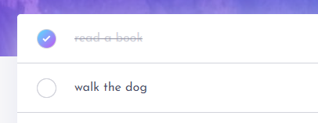

# Todo List

This todo-app performs users such functions as:

- adding tasks
- deleting tasks
- marking tasks as completed
- authentication using Google account  
- theme switching
___

### Preview


:eyes: **Preview**: [click here](https://yevavin.github.io/todo-list/)

### Install

``` git clone https://github.com/yevavin/todo-list.git ```

### Built with

- Semantic HTML5 markup
- Flexbox
- Mobile-first workflow
- Firebase

### Components development

:ballot_box_with_check: **Custom checkbox**

HTML:

```html
<div class="todo-list__item">
   <label class="todo-list__item-label"></label>
   <input type="checkbox" class="todo-list__item-checkbox"/>
   <div class="todo-list__item-btn"></div>
</div> 
 ```

SCSS:
```scss
.todo-list { //outer container
  margin-top: -24px;
  width: 100%;
  border-radius: 5px;

  &__item {
    width: 100%;
    height: 49px;
    padding: 17px 45px;
    font-size: 16px;
    position: relative;
    display: flex;
    align-items: center;

    &-checkbox {
      position: absolute;
      left: 15px;
      top: 15px;
      visibility: hidden;
      -moz-appearance: initial;
      &::after, &::before {
        content: "";
        width: 19px;
        height: 19px;
        border: 1px solid $lt-light-grayish-blue;
        border-radius: 100%;
        position: absolute;
        left: 0px;
        top: -1px;
        display: block;
        visibility: visible;
        transition: all .2s;
      }
      &:hover::after {
        cursor: pointer;
        border-color: $checkbox-bg-2;
      }
      &:checked::before {
        background: linear-gradient(-45deg, $checkbox-bg-2, $checkbox-bg-1);
      }
      &:checked::after {
        background-image: url(../images/icon-check.svg);
        background-repeat: no-repeat;
        background-position: center;
        border: none;
      }
    }
  }
}  
 ```


